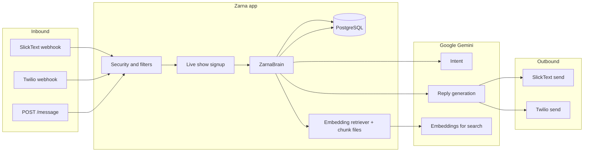

# Zarna AI — Engineering overview

This document explains how the texting assistant is built, how messages move through the system, and how replies are chosen. It is written for readers who are not engineers day-to-day, with enough technical detail for someone who wants to go deeper.

---

## What this system does

Fans text a phone number (usually via **SlickText**, sometimes **Twilio** SMS or WhatsApp). Each inbound text can trigger an automated reply that sounds like **Zarna**: short, conversational answers grounded in her real material (shows, clips, book, podcast, and general fan chat).

The app is a **Python web service** (Flask) that receives webhooks, stores conversations in a database, calls **Google Gemini** for understanding and wording, and sends the reply back through the same SMS provider.

---

## High-level architecture

- **PostgreSQL** holds contacts, every stored message (user and assistant roles), fan memory used for personalization, and live-show tables (signups, broadcasts, audit log).
- **Precomputed embeddings** (built offline from transcripts and other sources) live in the repo as compressed JSON; at runtime the app embeds the fan’s latest message and finds the most similar text chunks. That is the “memory” of facts and stories, separate from per-fan memory in the database.

---

## How messages are routed

Routing is deterministic: the same steps run for every inbound message, with early exits where we intentionally do not reply.

### 1. Entry points

| Entry | Typical use |
|--------|-------------|
| `POST /slicktext/webhook` | Main fan texting keyword (SlickText forwards each inbound SMS here). |
| `POST /twilio/webhook` | Alternate channel (SMS or WhatsApp); Twilio signature can be validated. |
| `POST /message` | Test or internal API; requires API key in production; rate-limited by caller IP. |

### 2. Security and hygiene (before the AI runs)

- **SlickText**: If `SLICKTEXT_WEBHOOK_SECRET` is set in production, requests must include a matching `X-Zarna-Webhook-Secret` header.
- **Twilio**: Optional validation of `X-Twilio-Signature` so only Twilio can hit the webhook.
- **Deduplication**: The last ~200 SlickText message IDs / Twilio SIDs are remembered so duplicate webhook deliveries do not double-process.
- **Filtering (no AI)**: Carrier keywords (`STOP`, `HELP`, …), subscription keywords like `ZARNa` used only for list signup, **emoji-only** texts, and **reaction** lines from phones (“Liked …”, “Reacted …”) are dropped for the AI path so the bot does not answer them.

### 3. Live show branch

If the text matches a **live show signup** flow (keyword, timing, rules in the live-shows module), the system may:

- Record the signup in the database.
- Send a **confirmation SMS** (async, so the webhook returns quickly).
- Set **suppress AI** when the fan only joined via a marketing keyword and should not get a generic chat reply on that message.

### 4. Rate limiting and capacity (AI path only)

- **Per phone number** (SlickText/Twilio path): a sliding window limits how many messages can enter the AI pipeline per minute (spam / abuse protection).
- **Global concurrency**: A configurable cap on simultaneous AI reply jobs (`AI_REPLY_MAX_CONCURRENT`, default 16 per worker). Extra load may be rejected with HTTP 503 on `/message` or dropped with a logged warning on webhooks.

### 5. Async processing

For SlickText and Twilio, once the message is accepted, the heavy work often runs in a **background thread** so the provider gets a fast HTTP response. The thread runs the brain, then sends the outbound SMS if there is a non-empty reply.

---

## How we decide what to say (the “brain”)

The core class is **`ZarnaBrain`**. For each inbound line it:

1. **Ensures the contact exists** and **stores the user message** in Postgres (or in-memory storage in local dev without `DATABASE_URL`).
2. **Conversation closers**: Short acks like “lol”, “thanks”, “ok” (with guardrails so “ok but why?” still gets a reply) **do not** generate a reply; the user message is still saved.
3. **Loads recent history** (last several turns, configurable) and **fan memory** (short personalized notes from earlier turns).
4. **In parallel**:
   - **Intent classification** — is this about a joke, clip, show/tickets, book, podcast, or general chat?
   - **Retrieval** — embed the user text, score pre-stored chunks with cosine similarity, take the top matches (e.g. top 7).
5. Intent uses **fast keyword rules** first (saves latency and API calls); if unclear, a **small Gemini prompt** returns a single intent label.
6. **Reply generation**: Another Gemini call uses intent, retrieved chunks, history, fan memory, and a long **style guide** (voice, length, empathy rules, what to avoid). A separate path adjusts **emphasis** (e.g. asterisks) so the tone does not feel over-formatted in sensitive or repetitive chats.
7. **Stores the assistant message**, then **updates fan memory in the background** (best-effort). If a **minor** is detected in the message, profile memory is cleared and not updated (privacy/COPPA-oriented behavior).

So: **routing** is rules + webhooks; **content** is retrieval + classification + one main generation step, all driven by Gemini (`gemini-2.5-flash` for chat/intent, `gemini-embedding-001` for search vectors).

---

## Important operational aspects

- **Hosting**: Designed to run on **Railway** (or similar): `DATABASE_URL` selects Postgres storage; without it, behavior falls back to in-memory storage (good for tests, not for real fans).
- **Admin dashboard**: Password-protected **`/admin`** shows subscriber counts, message volume, charts, tags, and full threads — backed by the same Postgres tables.
- **Observability**: In-process counters (per worker) track things like webhook auth failures, Twilio signature failures, AI errors, and capacity rejects — useful in logs alongside standard Python logging.
- **Knowledge base size**: The embedded corpus shipped with the app is on the order of **thousands** of chunks (see `training_data/`). Updating answers for new specials or tours usually means refreshing those chunks and embeddings, not changing the routing code.

---

## Glossary

| Term | Meaning |
|------|---------|
| **Webhook** | HTTP callback: SlickText or Twilio POSTs to our server when a fan sends a text. |
| **Intent** | High-level category of what the fan wants (joke, clip, show, book, podcast, general). |
| **Chunk** | A short passage of source material with a vector embedding for similarity search. |
| **Fan memory** | Short text + optional tags/location stored per phone for personalization, updated over time. |
| **Role** | In the database, each message is labeled `user` or `assistant` to rebuild threads. |

---

*Generated from the current codebase (Flask, Postgres, Gemini, SlickText/Twilio). For deployment variables and security hardening, see `app/config.py`, `app/inbound_security.py`, and operations docs.*
